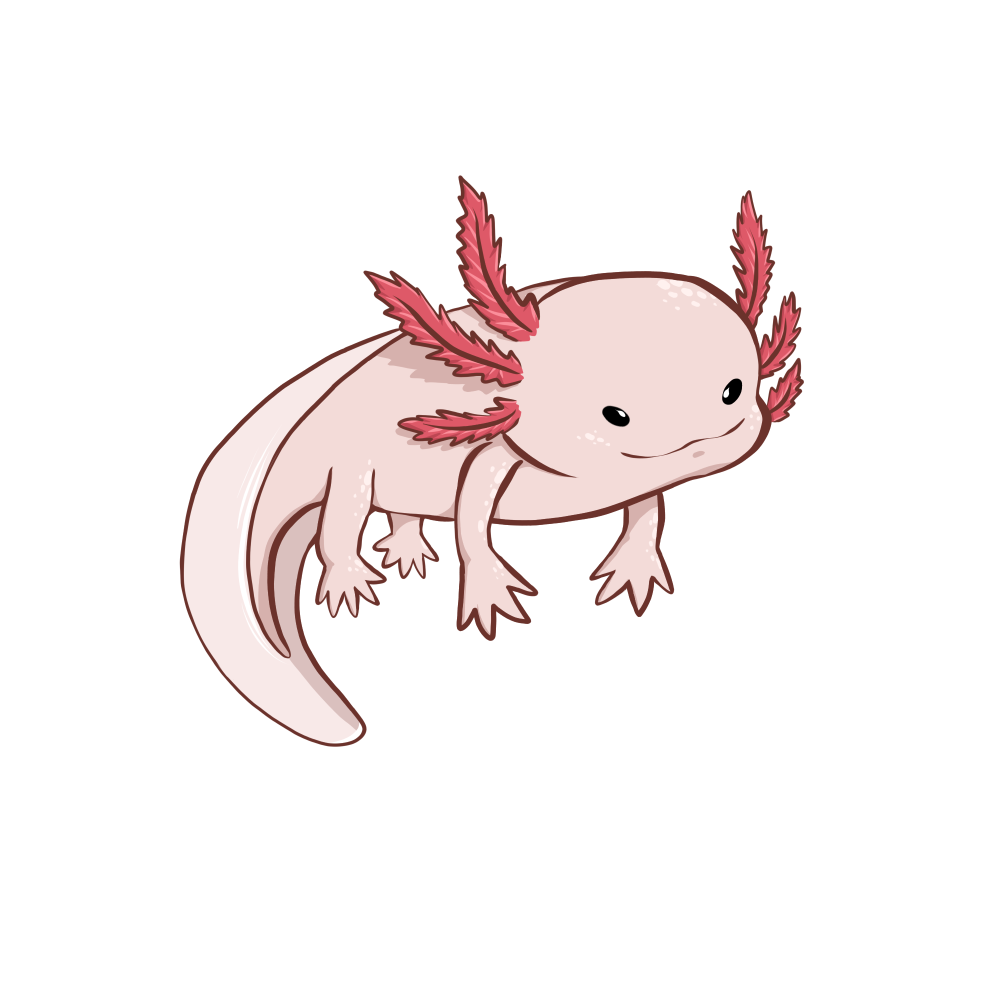

<p align="center">
    
    <h1>Blazor Axolotl Engine</h1>
</p>

Blazor Axolotl Engine aims to be a simple, lightweight, and fast 2D game engine for the web. It has an integrated Entity Component System (ECS) and a simple API to create games.
The game engine is based on the [Blazor Canvas Extension](https://github.com/BlazorExtensions/Canvas) and uses the [Blazor WebAssembly](https://dotnet.microsoft.com/apps/aspnet/web-apps/client) framework.

Example of some code with ECS (Entity Component System):

```csharp
var world = new World();
var entity = new TestSystem(); // You must create a class that inherits from ISystem, it can be a tank, a player, a bullet, etc.

world.AssignTo<TransformComponent(entity);

if (entity.Has<TransformComponent>()) {
    var transform = entity.Get<TransformComponent>();
    transform.Position = new Vector2(0, 0);
}
```

The ECS part is made to be mindless, so you can focus on the game logic. The rendering part of the engine will be either wrapped or either made by the user.
The ECS part is optional, you can use the engine without it. 

This README.md is minding to be updated with more information about the engine.

Feel free to leave a star and contribute to the project!